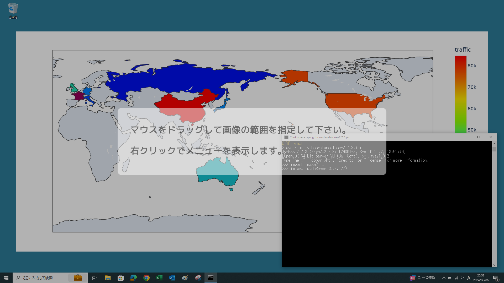
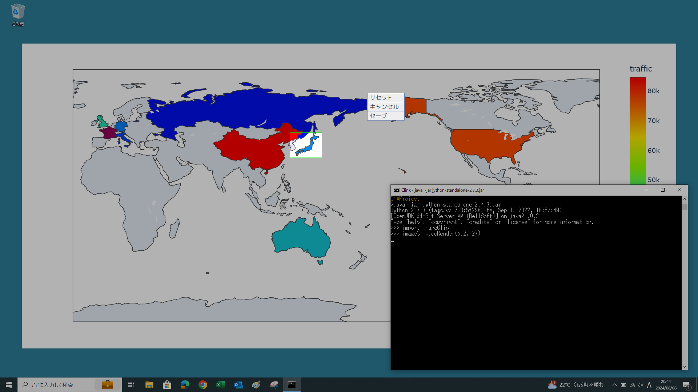
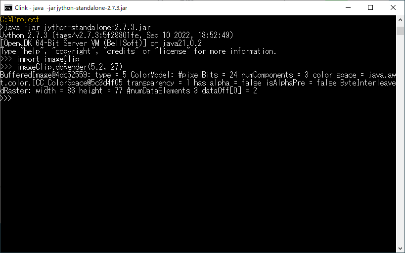
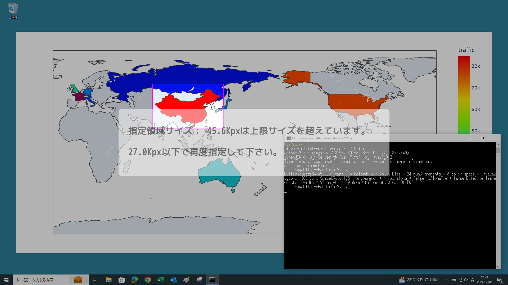
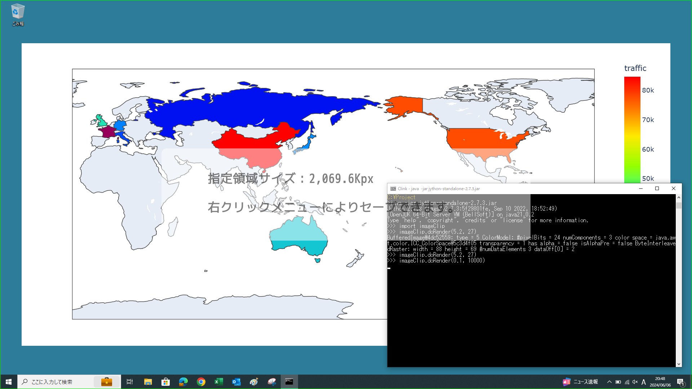

## Jythonで実装したデスクトップ画面トリミングツール

Jythonにより実装した、デスクトップ画面上の任意の矩形画像をトリミングするツールです。<br />
単独で実行できるモジュールとなっており、JythonやJavaのプログラムから呼び出して利用することができます。<br />
モジュール内で定義されている**doRender**関数により、ツールを起動します。<br />
VLゴシックフォントを前提としていますが、インストールされていなければ、代替フォントが使用されます。

### doRender関数の仕様
```
<戻り値>
説明：トリミングした画像データで、キャンセルした場合はNone
データ型：java.awt.image.BufferedImage型、もしくはNone

<第1引数>
説明：トリミング可能な画像データの最小サイズ
データ型：正のfloat型の数値で単位はKpx(キロピクセル)

<第2引数>
説明：トリミング可能な画像データの最大サイズ
データ型：正のfloat型の数値で単位はKpx(キロピクセル)

※第1/第2引数は小数点以下を1桁のみ指定可。2桁以上指定するとエラー。
※第1引数の最小値は0.1
```

### ＜実行例の事前準備＞

次項でjshellを使いますが、実行環境のみのjreパッケージには含まれないので、開発環境を含むjdkパッケージ（バージョン9以上）を用意しておきます。jdkは[Oracle][1]、[Adptium][2]、[BellSoft][3]などのプロジェクトのサイトから入手できます（WindowsとMacで動作確認）。<br />
jdkは任意のディレクトリに配置した上で、javaコマンドを実行できるように環境変数PATHを設定しておきます。<br />
またJythonランタイムのjarファイルは[こちら][4]からダウンロードできます。

[1]: https://www.oracle.com/jp/java/technologies/downloads/
[2]: https://adoptium.net/temurin/archive/
[3]: https://bell-sw.com/pages/downloads/
[4]: https://repo1.maven.org/maven2/org/python/jython-standalone/2.7.3/jython-standalone-2.7.3.jar

### ＜Jythonインタプリタより起動する例＞

まず下記のコマンドによりJythonインタプリタを対話モードで起動します（サンプル画面はすべてWindows）。
```PowerShell
java -jar jython-standalone-2.7.3.jar
```

Jythonインタプリタが起動したら、プロンプトに続けて下記のようにコードを入力します。
```
>>> import imageClip
>>> imageClip.doRender(5.2, 27)
```

デスクトップ画面のトリミングツールが起動します。指定可能な画像サイズの下限は5.2Kpx、上限は27Kpxとしておきます。
[](../../raw/master/figure1.webp)

ドラッグ操作により画像の範囲を指定すると、指定した領域のサイズを表示し、結果を保存するよう促します。
[](../../raw/master/figure2.webp)

任意の位置で右クリックするとメニューが表示され、「セーブ」を選択するとツールが終了します。
[](../../raw/master/figure3.webp)

ツール画面が終了すると、画像の取得結果が戻り値として表示されます。この例では幅86px、高さ77pxのBufferedImageが結果となっています。
[](../../raw/master/figure4.webp)


指定した画像のサイズが下限値と上限値の範囲に収まっていない場合は、エラーとなり、再度指定するよう促されます。
[](../../raw/master/figure5.webp)

サイズ制限無しでトリミング可能にする場合は最大サイズは十分大きい数値にしておけば大丈夫です。
```python
imageClip.doRender(0.1, 10000)
```
[](../../raw/master/figure6.webp)

### ＜Javaからツールを呼び出す例＞

今回はjshellにより、対話的にJavaから同様に起動してみます。jythonランタイムのjarファイルとimageClip.pyをカレントディレクトリに配置するものとして、まずはjshellを起動します。
```PowerShell
jshell -c jython-standalone-2.7.3.jar
```

jshellが起動したら、プロンプトにつづいて下記のようにコードを実行します。（コメントは省略して構いません）
```
jshell> // 必要なクラスをJythonのランタイムからインポート
jshell> import org.python.util.PythonInterpreter;
jshell> import org.python.core.PyString;
jshell> // Jythonインタプリタのオブジェクトを取得
jshell> PythonInterpreter pyProxy = new PythonInterpreter();
jshell> // Jythonのモジュール検索パスにカレントディレクトリを追加
jshell> pyProxy.getSystemState().path.append(new PyString("."));
jshell> // imageClipモジュールをインポート
jshell> pyProxy.exec("import imageClip");
jshell> // doRender関数を実行してツールを起動
jshell> pyProxy.exec("imageClip.doRender(5.2, 27)");
```
するとjythonインタプリタで実行した時と同様に、デスクトップ画面のトリミングツールが起動されます。
